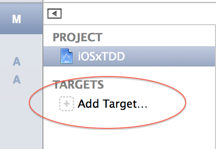
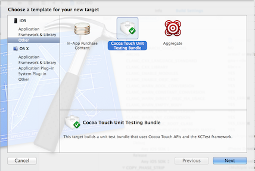
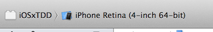
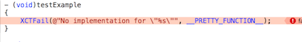

テストを動かす以前に動かす環境を作ります。⌘Uを押してテストが実行されれば、この投稿を読む必要はないです。

### Targetを追加する

プロジェクトから「Add Target...」を選択します

「Cocoa Touch Unit Testing Bundle」を選択します。残りを適当に設定すれば、プロジェクトにTargetが追加されます。

### スキームを設定する

次にスキームを設定します。先ほど作ったスキームを設定します。これで⌘Uで実行できるようになります。

### テストを実効する

⌘Uでテストを実行するとはじめから失敗するコードが書かれている失敗します。

これで、テストを書く準備が出来ました。