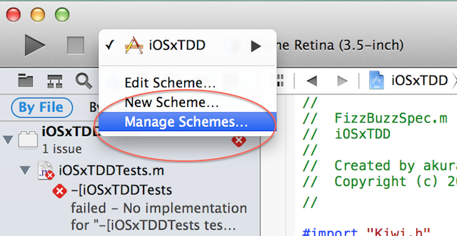
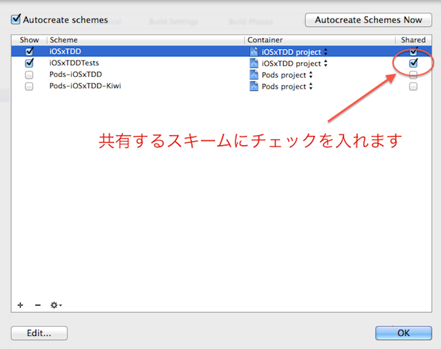

XcodeやAppCodeでテストを実行するのもいいですが、コマンドラインからテストを実行してみます。

CIツールを使う場合は、大抵コマンドラインからテストを実行できなければいけない。

## 参照

http://blog.ishkawa.org/blog/2013/04/14/travis-ci-ios/
http://efcl.info/2013/0613/res3301/
http://www.tokoro.me/2013/07/09/objc-travis-coveralls/
http://d.hatena.ne.jp/KishikawaKatsumi/20140211/1392056240
http://blog.dealforest.net/2013/04/travisci_ios_library/
http://blog.ishkawa.org/blog/2013/12/11/xcpretty/

## コマンドラインからテストを実行する

コマンドラインからテストを実行するためには、まずschemeを共有する必要がります。XcodeからManage Schemeを選択し、テストのスキームにsharedにチェックを入れます。




コマンドラインでテストを実行するためにはxcodebuildを使いますが、ビルドオプションだけでかなりの長さになる。そこで、makeを使ってビルドを行うことにします。Makefileに下記のような実行ルールで`make test`をで実行されます。

```
test:
	xcodebuild \
		-sdk iphonesimulator \
		-workspace iOSxTDD.xcworkspace \
		-scheme iOSxTDDTests \
		-configuration Debug \
		clean test \
		ONLY_ACTIVE_ARCH=NO \
		TEST_AFTER_BUILD=YES \
```

## xcprettyでテストの結果を見やすくする

xcodebuildで出力されるテストの結果はお世辞にも見やすいものとは言いがたいです。そこで出力されたログを`xcpretty`によって見やすく加工します。

### インストール方法

```
gem install xcpretty
```

### 使い方

```
make test | xcpretty -c
```

毎回makeの後に書くのも面倒なのでMakefileの最後に書いておくとよいです。