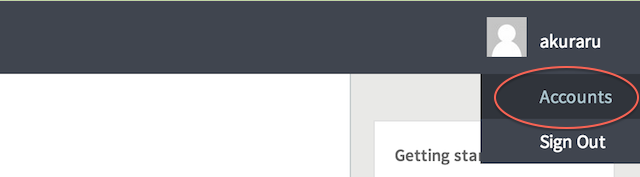
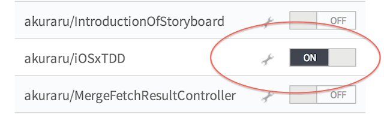
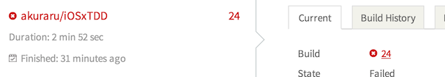

Travis CIでテストを動かします。コマンドラインでテストが動いているならならば、そこまで難しい無いはずです。

## 参照

http://blog.ishkawa.org/blog/2013/04/14/travis-ci-ios/
http://efcl.info/2013/0613/res3301/
http://www.tokoro.me/2013/07/09/objc-travis-coveralls/
http://d.hatena.ne.jp/KishikawaKatsumi/20140211/1392056240
http://blog.dealforest.net/2013/04/travisci_ios_library/
http://blog.ishkawa.org/blog/2013/12/11/xcpretty/

## Travis用のmakeスクリプトを書く

xcodebuildはテストの結果が見難いですが、Travis CIでxcprettyを使うと何故かテストに失敗してもStateがFailedにならなかったので、Travis用の

前に投稿したスクリプト同じ内容です。

http://qiita.com/akuraru/items/7e60c81f6e3b7f6947a4

```
travis:
	xcodebuild \
		-sdk iphonesimulator \
		-workspace iOSxTDD.xcworkspace \
		-scheme iOSxTDDTests \
		-configuration Debug \
		clean test \
		ONLY_ACTIVE_ARCH=NO
```

ローカル環境で動かなければ、基本的にはTravisでも動かないです。

## .travis.ymlを用意する

Travis CI用の設定ファイル .travis.yml を作成します。

```
language: objective-c
before_install:
  - sudo rvm use ruby-2.0.0-p247
  - gem install cocoapods -r
  - pod setup |> setup.log
script:
  - make travis
```

Travisの環境はよく変わるので、この設定では動かない場合があります。エラー文をよく読んで何とかしましょう。トップのリンクが参考になるかもしれません。

## Travisを設定する

Travis CIにサインインしてアカウント設定を開きます



CIで走らせたいプロジェクトをONに変えます。



ホームにプロジェクトが増え、CIの実行結果が表示されます。



これで、GithubにPushすれば、Travisが自動的に実行されます。